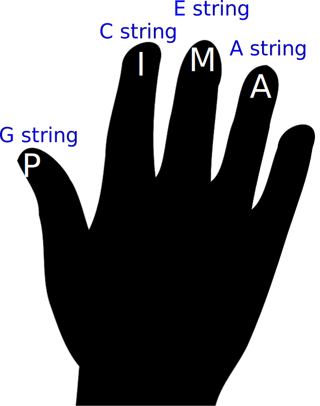

There are many ways to play the ukulele, but it can be helpful to learn popular methods and understand when to use them. The first right hand fingerstyle method we will introduce is sometimes called "PIMA," which assigns a dedicated finger on your right hand to each string. The name PIMA refers to the Spanish words used for each finger.  

For this exercise, assign your fingers to each string like this: 
<ul>
<li>G string - Thumb (abbreviated as P)</li>
<li>C string - Pointer, or index finger (abbreviated as I)</li>
<li>E string - Middle finger (abbreviated as M)</li>
<li>A string - Ring finger (abbreviated as A)</li></ul>

This method decreases the movement you must perform each time you pluck a string, and you don't need to think about which finger you should use because you already have a finger assigned. It also makes it easier to play a *bass line*, which we'll talk about later.